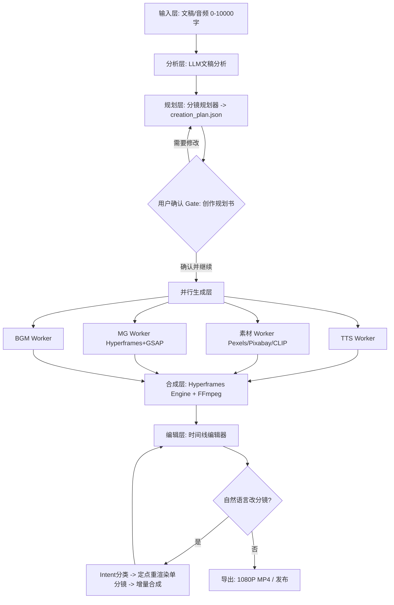
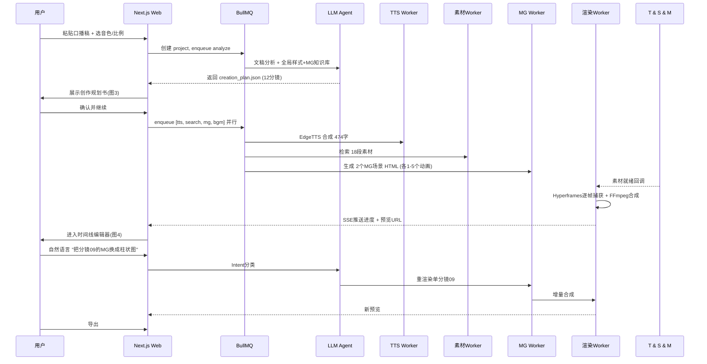

# 口播稿 → MG动画+视频素材短视频平台 · 开发文档 v1.0

> 对标：B站花生AI `huasheng.cn` (B站自研 Index-1.9B + 千万级可商用素材库 + 原生MG引擎 + Agent对话式创作)
> 引擎锁定：**Hyperframes 0.7.60 + GSAP** (Apache 2.0) | 架构：**标准版4层全上** | 工期：2-3周

---

## 1. 产品概述

### 1.1 一句话
输入口播稿/上传口播音频 → AI自动完成文稿分析、分镜规划、素材检索、MG动画生成、TTS、混音合成 → 用户在时间线编辑器中确认/自然语言改分镜 → 导出1080P成片，3分钟成片。

### 1.2 核心价值
解决创作者剪辑门槛高、素材匹配难、MG动画不会做、周期长的痛点。复刻花生的 **B模式 - 素材混合MG动画**，而非纯素材剪辑。

### 1.3 术语
*   **口播稿**：200-5000字文稿，系统会用TTS完整读出
*   **分镜(Scene)**：按语义切分的5-7秒片段，12个左右/1分钟视频
*   **B模式**：每分镜 = 视频素材(底) + MG动画(透明叠加层) + 字幕(顶)
*   **创作规划书**：LLM生成的 `画面类型|口播脚本|画面描述` 表格，需用户确认后才渲染
*   **预估消耗**：仿花生积分，素材*18免费 + MG*2=186 + TTS

---

## 2. 对标分析：花生AI真实流程 (基于4张截图)

### 2.1 入口页 `huasheng.cn/?jumpfrom=creatorcenter_top` (图2)
*   标题 `让文字穿越到影像的世界`，副标题 `即刻成片，让每个观点都被看见`
*   输入区：`输入文稿 / 上传口播` Tab，计数 `0/10000`，选择器 `科普男主1` `16:9` `标准模式` `偏好01` → `创建`
*   底部推荐案例/官方活动/分类过滤

### 2.2 Agent规划阶段 (图1)
```
用户文稿(高铁硬币) → 加载producer skill → 检查本地素材(无) → 偏好为方案B
→ 读取MG方案知识库 + BGM情感指南 + 全局样式规范 + 年代背景规范
→ 文稿分析：主题"高铁与普通铁路轨道技术对比" 类型"科学科普(科技工程类)"
→ 直接走 B - 素材混合MG动画方案 → 按规范生成内容写入meta
```
关键：不是按句切分，而是理解叙事结构、情感起伏、数据点，规划有起承转合的分镜。

### 2.3 创作规划书 (图3)
*   表结构：`| 画面类型 | 口播脚本(6条) | 画面描述 |`
*   画面类型：`视频素材` / `MG动画` / `视频素材+MG动画`
*   脚本示例：`当列车时速超过250公里，带起的气流会把道砟石子像子弹一样吸起来...这叫"道砟飞溅"`
*   画面描述：
    *   素材检索：`专名清单:无 / 国家:中国/年份:现代 / 素材来源:通用素材库(高铁轨道板精调实拍、卫星定位示意图、激光测量仪器特写、高山峡谷高铁桥梁空镜) / 素材偏好:工程精密感，冷色调，避免人物正脸`
    *   MG动画：`口播"刚性面板"时，画面上出现一段MG动画，将轨道板简化为一灰色矩形，并用蓝色线条勾勒出精调过程...卫星小图标在轨道板上方闪烁...`
*   右侧计量：`画面构建 258→186 | 视频素材匹配*18 会员免费 72→0 | MG动画场景*2 186 | 旁白配音 花知深(474字) 44→0 | 速率模式 标准模式 0 | 总预估消耗 186` → `确认并继续` 

### 2.4 时间线编辑器 (图4)
*   顶部：文稿字幕侧边栏 + 中央预览 + 右侧分镜详情
*   预览：蓝科技网格视频底 + `智能知识库`黑色MG卡片 + 字幕 `所以现在很多AI知识库，智能搜索，推荐系统` + 顶部`编辑裁切`
*   轨道：`分镜07 00:09 / 08 00:06 / 09 00:06(MG动画) / 10 00:06 / 11 00:05 / 12 00:05` 共12分镜，总时长 `00:01:16`
*   右侧：`视频素材`6选1(显示使用中) + `重配画面 / 展开更多` + 提示 `9个MG动画全部成功叠加 | BGM已自动配好:通用平和风格` + 自然语言输入 `输入你的任何想法 + 分镜09`

---

## 3. 总体流程





---

## 4. 系统架构

```mermaid
graph TB
    subgraph 前端层
        A[Next.js 15 App Router]
        A1[输入页]
        A2[规划书页]
        A3[时间线编辑器]
        A1 & A2 & A3 --- A
    end
    subgraph 服务层
        B[BFF / API Routes]
        C[BullMQ + Redis]
        D[Postgres + Drizzle]
        E[R2/S3 对象存储]
    end
    subgraph AI与生成层
        F[LLM Gateway<br/>DeepSeek-V3 / Qwen / Claude兼容]
        G[TTS Service<br/>EdgeTTS + FishAudio]
        H[素材检索<br/>Pexels/Pixabay + CLIP]
        I[MG渲染<br/>Hyperframes 0.7.60 + GSAP]
        J[STT/字幕<br/>whisper.cpp]
        K[BGM库]
    end
    subgraph 合成层
        L[Hyperframes Engine<br/>Puppeteer + Chromium]
        M[FFmpeg 6<br/>overlay + amix + burn-in]
    end
    A --> B --> C --> F & G & H & I
    C --> L --> M --> E
    B --> D
    A3 --> B
```



### 职责
*   **前端**：输入/确认/编辑三页，SSE实时进度，编辑器基于 `plan.json` 驱动
*   **BFF**：鉴权、限流、项目CRUD、Gate状态机
*   **队列**：分析/生成/渲染三类Job，可重试、幂等
*   **存储**：PG存结构化，R2存视频/音频/图片，Redis存进度

---

## 5. 技术栈

| 层 | 技术 | 说明 |
|---|---|---|
| 前端 | Next.js 15, React 18, Tailwind CSS, Zustand | 图2/3/4还原 |
| 队列 | BullMQ + Redis 7 | 并行扇出 |
| 数据库 | Postgres 16 + Drizzle ORM | |
| 对象存储 | Cloudflare R2 / S3 | |
| LLM | DeepSeek-V3 (OpenAI兼容) + 提示词工程 | 成本低，预留Index/Claude |
| TTS | EdgeTTS (免费默认) + FishAudio/ElevenLabs (克隆) | 10s样本克隆 |
| STT | whisper.cpp | 词级时间戳 |
| 素材 | Pexels/Pixabay API + CLIP ViT-B/32 | 工程精密感/冷色调过滤 |
| MG渲染 | Hyperframes 0.7.60 + GSAP 3 + Lottie | Apache2.0，无打包 |
| 合成 | FFmpeg 6 + ffprobe | overlay, amix -18dB ducking |
| 部署 | Docker Compose, Node 22, FFmpeg, Chromium | 本地优先 |

**为什么 Hyperframes 而非 Remotion**：花生是 HTML+GSAP叠加，Hyperframes原生支持 `HTML覆盖视频+透明层`，无Remotion的 Company License 限制，LLM直接写HTML成本更低。详见 `heygen-com/hyperframes` vs `remotion-dev/remotion`。

---

## 6. 核心模块详设

### 6.1 文稿分析 Agent
*   输入：口播稿文本(474字示例)
*   系统提示词包含：全局样式规范(科普类冷色调/工程感)、年代背景规范(现代中国)、MG知识库(何时触发图表/流程图/对比)、BGM情感指南(通用平和)
*   输出：
```json
{
  "topic": "高铁与普通铁路轨道技术对比",
  "type": "科学科普-科技工程类",
  "keywords": ["道砟飞溅", "毫米级精调", "无砟轨道"],
  "emotion": "平和-科普",
  "structure": ["对比引入", "问题揭示", "解决方案", "精度指标"]
}
```

### 6.2 分镜规划器
输出 `creation_plan.json` (12分镜)：
```json
{
  "scenes": [
    {
      "id": "03",
      "durationSec": 6,
      "narration": "铺设这种混凝土轨道板时，全程由卫星和激光引导...",
      "search": {"query": "高铁轨道板精调实拍 激光测量", "filters": {"country":"CN","year":"modern","mood":"precise","tone":"cold"}},
      "mg": {"trigger": "卫星定位", "type": "流程图", "htmlPrompt": "灰色矩形轨道板+卫星图标闪烁+激光线交汇"},
      "bgm": "通用平和"
    }
  ]
}
```

### 6.3 物料生成 (并行)
*   **TTS Worker**：调用 EdgeTTS `zh-CN-YunxiNeural`，Whisper生成 `word-level .vtt`，计算每句时长校正分镜duration
*   **素材Worker**：Pexels搜索 `query`，CLIP重排，筛选 18段 16:9 1080P，记录 provenance
*   **MG Worker**：LLM根据 `mg.htmlPrompt` 生成 `scene03.html` (见 §8)，`hyperframes lint` → `hyperframes render --format mp4`
*   **BGM Worker**：按 emotion 选库内音乐，FFmpeg `amix` 音量 -18dB

### 6.4 合成与字幕
*   Hyperframes Engine：Puppeteer驱动Chromium，以 `fps=30` 逐帧截图
*   FFmpeg：`[0:v][1:v]overlay=0:0` 叠MG层，`amix`混BGM，`subtitles=words.vtt:force_style='Fontsize=36,Outline=2'` 烧录
*   产物：`renders/{projectId}/final.mp4` + `plan.json` + `words.vtt`

### 6.5 Agent对话式编辑
*   输入：`把前3个分镜合并 / 把所有外国人素材换成中国人 / 把分镜09的MG换成柱状图`
*   流程：LLM分类 → `intent: {target:"scene09", op:"replace_mg", payload:{chart:"bar"}}` → 仅重跑 M Worker 单分镜 → 增量合成 (FFmpeg concat 替换该段) → 推送新预览
*   版本：`snapshots/v{n}` 文件拷贝 + PG记录，支持撤销

---

## 7. 数据模型

```sql
-- Postgres
project(id uuid pk, title text, script text, voice text, aspect text, mode text, status enum, created_at)
scene(id uuid pk, project_id fk, idx int, narration text, duration_ms int, search_query jsonb, mg_prompt text, bgm_mood text, status)
asset(id uuid pk, scene_id fk, type enum(video,mg,bgm,tts), url text, provider text, cost int, meta jsonb)
render_job(id uuid pk, project_id fk, plan_json jsonb, hyperframes_log text, status enum, created_at)
snapshot(id uuid pk, project_id fk, version int, plan_json jsonb, created_at)

-- Redis: bullmq:project:{id}:progress { analyzed:0/1, tts:0/1, search:0/1, mg:2/2, rendering:0/1 }
-- R2: /{projectId}/tts.wav, /footage/*.mp4, /mg/*.html, /final.mp4
```

---

## 8. MG叠在视频上 - Hyperframes 实现

这是本项目核心，复刻图3/图4的 B模式。

### 8.1 图层模型
每分镜 = `video(z0) + mg(z1, transparent) + subtitle(z2)`，`plan.json` 定义。

### 8.2 模板示例 `packages/hyperframes-templates/scene03.html`
```html
<!doctype html>
<html>
<head>
  <meta charset="utf-8">
  <style>
    body{margin:0;width:1920px;height:1080px;background:#000;overflow:hidden;font-family: sans-serif;}
    .footage{position:absolute;inset:0;width:100%;height:100%;object-fit:cover;filter:saturate(0.9) brightness(1.05);}
    .mg-layer{position:absolute;inset:0;pointer-events:none;}
    .card{position:absolute;left:50%;top:62%;transform:translateX(-50%);background:rgba(0,0,0,0.72);color:#fff;padding:18px 28px;border-radius:16px;font-size:42px;backdrop-filter:blur(8px);}
    .laser{stroke:#00E5FF;stroke-width:4;stroke-dasharray:12 8;filter:drop-shadow(0 0 8px #00E5FF);}
  </style>
  <script src="https://cdn.jsdelivr.net/npm/gsap@3.12/dist/gsap.min.js"></script>
</head>
<body>
  <div data-scene="0-6" style="position:relative;width:1920px;height:1080px">
    <video class="footage" src="./footage_轨道板.mp4" autoplay muted loop></video>
    <div class="mg-layer">
      <svg width="1920" height="1080" style="position:absolute;inset:0">
        <line class="laser" x1="320" y1="540" x2="960" y2="540" />
        <line class="laser" x1="1600" y1="540" x2="960" y2="540" />
        <circle cx="960" cy="540" r="18" fill="#00E5FF" />
      </svg>
      <div class="card">2毫米 ≈ 2.6张银行卡厚度</div>
    </div>
  </div>
  <script>
    // Hyperframes要求 seekable 动画，使用 gsap timeline
    const tl = gsap.timeline({paused:true});
    tl.from(".card", {y:40, opacity:0, duration:0.6, ease:"power3.out"}, 0.2)
      .from(".laser", {scaleX:0, transformOrigin:"center", duration:0.8, ease:"power2.inOut"}, 0);
    // Hyperframes会根据当前帧 seek tl
    window.__hyperframes_seek = (frame, fps) => tl.seek(frame/fps);
  </script>
</body>
</html>
```
*   验证：`npx hyperframes lint scene03.html` → `npx hyperframes render scene03.html -o out.mp4 --fps 30`
*   合成：FFmpeg `overlay` 将 out.mp4 (透明背景用 webm vp9 或直接Chromium捕获) 叠到底层实拍上。

### 8.3 LLM生成MG的提示词要点
*   常量置顶：颜色/文案/时长可编辑
*   规范：冷色调、工程感、避免人物正脸、字体思源黑体
*   动效：spring/GSAP，避免突变

---

## 9. API 设计

| 方法 | 路径 | 说明 |
|---|---|---|
| POST | /api/projects | 创建项目 {script, voice, aspect, mode, preference} → 返回 projectId + creation_plan |
| GET | /api/projects/:id | 获取规划书/状态 |
| POST | /api/projects/:id/confirm | 确认Gate → 触发并行生成 |
| GET | /api/projects/:id/status | SSE 推送进度 {tts:done, search:12/18, mg:1/2} |
| GET | /api/projects/:id/preview | 预览MP4 |
| POST | /api/projects/:id/edit | 自然语言编辑 {cmd} → 返回新plan |
| POST | /api/projects/:id/snapshots/:v/revert | 回滚 |
| POST | /api/render | 触发Hyperframes渲染 |
| GET | /health | 健康检查 |

---

## 10. 前端页面 (对应截图)

*   **/ (图2)**：Hero标题 + 输入卡片 + 选择器 + 推荐示例 (热点/财经/科普) + 邀请卡
*   **/project/[id]/plan (图3)**：左侧表格 + 右侧计量卡 + 底部 `偏好01` + `确认并继续` (消耗186)
*   **/project/[id]/edit (图4)**：三栏：左 字幕列表(分镜总数/总时长) | 中 预览+控制条 | 右 素材6宫格+MG状态+自然语言输入 + 底部轨道(分镜卡片+时长)

---

## 11. 部署与运维

*   **本地**：`docker compose up` (web, worker, redis, postgres, chromium, ffmpeg)
*   **依赖检查**：`node >=22`, `ffmpeg+ffprobe` 在 PATH, `npx hyperframes --version`
*   **配置**：`.env` 含 `PEXELS_API_KEY`, `PIXABAY_API_KEY`, `EDGE_TTS_VOICE`, `DEEPSEEK_API_KEY`
*   **自检**：`pnpm doctor` 检查 ffmpeg/ffprobe/node/hyperframes

---

## 12. 路线图 (2-3周)

*   **W1**：脚手架 + 文稿分析Agent + 分镜规划器(图3表格) + Pexels+EdgeTTS打通 + 单分镜 Hyperframes叠加跑通
*   **W2**：BullMQ并行化 + 12分镜合成 + 时间线编辑器(图4) + 积分计费 + SSE
*   **W3**：自然语言编辑 + BGM情感匹配 + 1080P导出 + `激光线/数据卡/卫星定位` 三个MG模板 + 自测(ffprobe/音量/字幕)

---

## 13. 开源选型参考

| 项目 | Star | 用途 |
|---|---|---|
| `harry0703/MoneyPrinterTurbo` 113k MIT | MVP底座：脚本→素材→TTS→FFmpeg |
| `calesthio/OpenMontage` 49k AGPL | 最全：12管线+700 Skill+双渲染 |
| `Orkas-AI/Orkas-VideoStudio` + `heygen-com/hyperframes` 42k Apache2 | MG核心：HTML+GSAP叠加 |
| `remotion-dev/template-prompt-to-motion-graphics-saas` | MG提示词/模板参考 |

---

## 14. 安全性与合规

*   素材仅用 Pexels/Pixabay可商用源，记录 provenance
*   TTS克隆需用户授权10s样本
*   导出无水印需会员校验

---

© 2026 Stuido
